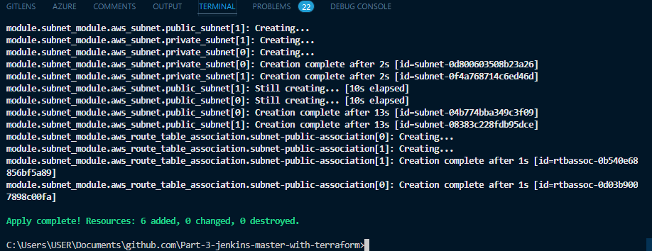
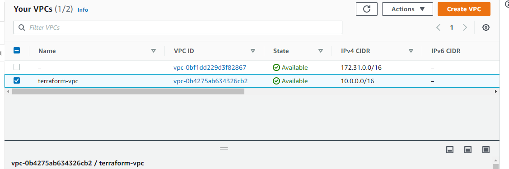
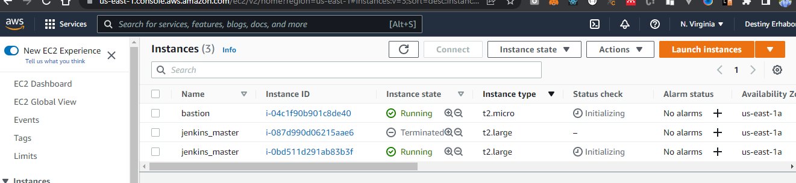
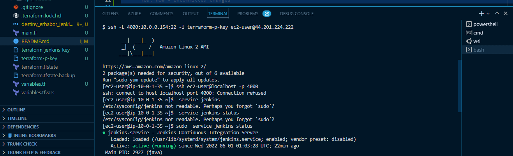
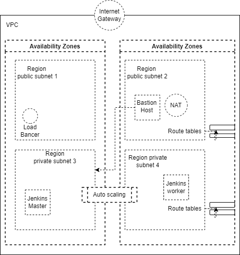

# Creating Jenkins instance with terraform

## Steps

- Take note of the ami name of the baked image from Challenge 2.
- Create network infrastructure (VPC, public and private subnets, network gateways, route tables and route table association)..
  - Create VPC
  - Create Internet gateway
  - Create custom route table
  - Create our subnets
  - Associate subnets with route table
- Create Security Groups for
  - Bastion
  - Jenkins load balancer
  - Jenkins security group
- Create a bastion-host server.
- Create jenkins server and only grant ssh access to bastion host.
- Setup an application load balancer (ALB) to access the jenkins server

### Provisioning an AWS VPC (Virtual private cloud)

We will be deploying our Jenkins cluster inside a VPC within private subnets; This is to allow us have full control of the network topology, we will create a VPC from scratch to isolate our Jenkins cluster from the application.

The VPC is divided into subnets which can either be

- public or
- private subnets

Routing rules between subnet allows traffic to go through either an internet gateway or NAT gateway.

### Initialize terraform and file Structure

Folder and Files stuctures

```
--- modules
    --- bastion_module
        --- main.tf
        --- output.tf
        --- variable.tf
    --- *
--- main.tf
--- variables.tf
--- variables.tfvars
--- README.md
--- .gitignore

```

The main.tf file will serve as our entry point. We start by providing the following code inside to configure our provider to aws and authenticate us.

```
provider "aws" {
  region     = "${var.aws_profile[0]}"
  access_key = "${var.aws_profile[1]}"
  secret_key = "${var.aws_profile[2]}"
}

```

Now , run the following in your terminal to initial your provider

_RUN_
run the following in your terminal

> > terraform init
> > terraform plan --var-file="variables.tfvars"
> > terraform apply --var-file="variables.tfvars"



NB - We will constantly update this root main.tf file.

#### Creating a VPC

Enter the following code in **module/vpc_module/main.tf** saves its variable and output in the variable and output file inside the module folder

```
resource "aws_vpc" "vpc-module" {
  cidr_block = "${var.cidr_block}"

  tags = {
    Name = "${var.vpc_name}"
  }
}
```

**module/vpc_module/output.tf**

```
output vpc_id {
  value       = "${aws_vpc.vpc-module.id}"
}
```

**module/vpc_module/variable.tf**

```
variable "cidr_block" {
  type        = string
  default     = "10.0.0.0/16"
  description = "VPC cidr block"
}
variable "vpc_name" {
  type        = string
  description = "VPC name"
}
```

_RUN_
>> Terraform init
>> terraform plan --var-file="variables.tfvars"
>> terraform apply --var-file="variables.tfvars"



### Create an internet gate way

Enter the following code in **module/subnet_module/main.tf** and saves its variable and output in the variable and output file inside the module folder

```
resource "aws_internet_gateway" "igw" {
  vpc_id = "${var.vpc_id}"

  tags = {
    Name = "igw_${var.vpc_name}"
  }
}
```

### Custom route table

Enter the following code in **module/route-table_module/main.tf** and saves its variable and output in the variable and output file inside the module folder

```
resource "aws_route_table" "public_rt" {
  vpc_id = "${var.vpc_id}"
  route {
    cidr_block = "0.0.0.0/0"
    gateway_id = "${var.igw_id}"
  }
  tags = {
    Name = "public_rt_${var.vpc_name}"
  }
}

```

### Create our subnets and associate with route tables

Enter the following code in **module/route-table_module/main.tf** and saves its variable and output in the variable and output file inside the module folder

```
resource "aws_subnet" "public_subnet" {
  vpc_id                         = "${var.vpc_id}"
  cidr_block                     = "10.0.${count.index * 2 + 1}.0/24"
  availability_zone              = element(var.availability_zone, count.index)
  map_public_ip_on_launch         = true

  count                          = "${var.public_subnets_count}"

  tags = {
    Name = "public_10.0.${count.index *2 + 1}.0_${element(var.availability_zone, count.index)}"
  }
}

resource "aws_subnet" "private_subnet" {
  vpc_id                         = "${var.vpc_id}"
  cidr_block                     = "10.0.${count.index * 2}.0/24"
  availability_zone              = element(var.availability_zone, count.index)
  map_public_ip_on_launch         = false

  count                          = "${var.private_subnets_count}"

  tags = {
    Name = "private_10.0.${count.index *2}.0_element(var.availability_zone, count.index)"
  }
}

# assign public subnet to the route table
resource "aws_route_table_association" "subnet-public-association" {
  count          = "${var.public_subnets_count}"
  subnet_id      = element("${aws_subnet.public_subnet.*.id}", count.index)
  route_table_id = "${var.public_rt_id}"
}

# assign private subnet to the route table
 resource "aws_route_table_association" "subnet-private-association" {
   subnet_id      = "${aws_subnet.subnet_private.id}"
   route_table_id = "${var.route_table_id}"
 }

```

#### Update the main.tf file as follow and run the following command

```
provider "aws" {
  region     = "${var.aws_profile[0]}"
  access_key = "${var.aws_profile[1]}"
  secret_key = "${var.aws_profile[2]}"
}

# vpc
module "vpc_module" {
  source = "./modules/vpc_module"
  vpc_name = "${var.vpc_name}"
}
module "igw_id" {
  source = "./modules/internet-gateway_module"
  vpc_id = "${module.vpc_module.vpc_id}"
  vpc_name = "${var.vpc_name}"
}
module "route_table_module" {
  source = "./modules/route-table_module"
  vpc_id = "${module.vpc_module.vpc_id}"
  igw_id = "${module.igw_id.igw_id}"
  vpc_name = "${var.vpc_name}"
}

module "subnet_module" {
  source = "./modules/subnet_module"
  vpc_id = "${module.vpc_module.vpc_id}"
  availability_zone = "${var.availability_zone}"
  public_rt_id = "${module.route_table_module.public_rt_id}"
}
```

### Security groups

Create security groups folder for bastion, jenkins_alb, jenkins_master inside the **module/security-group_module**

- **module/security-group_module/bastion_security_module/main.tf**

```
variable "vpc_name" {}
variable "vpc_id" {}

// Bastion Security group
resource "aws_security_group" "bastion_host" {
  name        = "bastion_sg_${var.vpc_name}"
  description = "Allow SSH from anywhere"
  vpc_id      = "${var.vpc_id}"

  egress {
    from_port   = 0
    to_port     = 0
    protocol    = "-1"
    cidr_blocks = ["0.0.0.0/0"]
  }

  ingress {
    from_port       = 22
    to_port         = 22
    protocol        = "tcp"
    cidr_blocks = ["0.0.0.0/0"]
  }

  tags = {
    Name   = "bastion_sg_${var.vpc_name}"
  }
}

```

- **module/security-group_module/jenkins_alb_security/main.tf**

```
variable "vpc_id" {}

// Jenkins ALB Security group
resource "aws_security_group" "alb_jenkins_sg" {
  name        = "alb_jenkins_sg"
  description = "Allow http traffic"
  vpc_id      = var.vpc_id
  
  ingress {
    from_port   = "80"
    to_port     = "80"
    protocol    = "tcp"
    cidr_blocks = ["0.0.0.0/0"]
  }

  ingress {
    from_port   = "443"
    to_port     = "443"
    protocol    = "tcp"
    cidr_blocks = ["0.0.0.0/0"]
  }

  egress {
    from_port   = "0"
    to_port     = "0"
    protocol    = "-1"
    cidr_blocks = ["0.0.0.0/0"]
  }

  tags = {
    Name   = "alb_jenkins_sg"
  }
}

```

- **module/security-group_module/jenkins_master_security/main.tf**

```
variable "baston_host_sg_id" {}
variable "alb_jenkins_sg_id" {}
variable "vpc_name" {}
variable "vpc_id" {}

resource "aws_security_group" "jenkins_master_sg" {
  name        = "jenkins_master_sg"
  description = "Allow traffic on port 8080 and enable SSH"
  vpc_id      = var.vpc_id

  ingress {
    from_port       = "22"
    to_port         = "22"
    protocol        = "tcp"
    security_groups = [var.baston_host_sg_id]
  }

  ingress {
    from_port       = "8080"
    to_port         = "8080"
    protocol        = "tcp"
    security_groups = [var.alb_jenkins_sg_id]
    cidr_blocks = ["0.0.0.0/0"]
  }

  egress {
    from_port   = "0"
    to_port     = "0"
    protocol    = "-1"
    cidr_blocks = ["0.0.0.0/0"]
  }

  tags = {
    Name   = "jenkins_master_sg"
  }
}

output "jenkins_master_id" {
  value = "${aws_security_group.jenkins_master_sg.id}"
}
```

### Create a bastion-host server

Enter the following code in **module/bastion_module/main.tf** and saves its variable and output in the variable and output file inside the module folder

```
variable "baston_host_sg_id" {}
variable "subnet_public" {}

# create key pair
resource "tls_private_key" "rsa" {
  algorithm = "RSA"
  rsa_bits = 4096
}

// Management Key Pair
resource "aws_key_pair" "terraform-p-key" {
  key_name   = "terraform-p-key"
  public_key = "${tls_private_key.rsa.public_key_openssh}"
}

resource "local_file" "terraform-server-private-key" {
  content = "${tls_private_key.rsa.private_key_pem}"
  filename = "terraform-p-key"
}

// Bastion AMI
data "aws_ami" "bastion" {
  most_recent = true
  owners = ["self"]
}

// Bastion instance
resource "aws_instance" "bastion" {
  ami           = data.aws_ami.bastion.id
  instance_type = "t2.micro"
  key_name = aws_key_pair.terraform-p-key.id
  vpc_security_group_ids = [var.baston_host_sg_id]
  subnet_id = element(var.subnet_public, 0).id
  associate_public_ip_address = true

  tags = {
    Name = "bastion"
  }
}

```

### Create jenkins server

Enter the following code in **module/jenkins-master_module/main.tf** and saves its variable and output in the variable and output file inside the module folder

```
variable "jenkins_master_sg_id" {}
variable "subnet_private" {}
variable "alb_jenkins_sg_id" {}
variable "subnet_public" {}
variable "vpc_id" {}

data "aws_ami" "jenkins-master" {
  most_recent = true
  owners      = ["self"]
}
  
# create key pair
resource "tls_private_key" "rsa" {
  algorithm = "RSA"
  rsa_bits = 4096
}

// Management Key Pair
resource "aws_key_pair" "terraform-jenkins-key" {
  key_name   = "terraform-jenkins-key"
  public_key = "${tls_private_key.rsa.public_key_openssh}"
}

resource "local_file" "terraform-server-private-key" {
  content = "${tls_private_key.rsa.private_key_pem}"
  filename = "terraform-jenkins-key"
}

resource "aws_instance" "jenkins_master" {
  ami                    = data.aws_ami.jenkins-master.id
  instance_type          = "t2.large"
  key_name               = aws_key_pair.terraform-jenkins-key.id
  vpc_security_group_ids = [var.jenkins_master_sg_id]
  subnet_id              = element(var.subnet_private, 0).id

  root_block_device {
    volume_type           = "gp3"
    volume_size           = 30
    delete_on_termination = false
  }

  tags = {
    Name   = "jenkins_master"
  }
}


```

>> terraform init
>> terraform plan --var-file="variables.tfvars"
>> terraform apply --var-file="variables.tfvars"



**ssh into the instance by host forwarding**

>> ssh -L 4000:10.0.0.154:22 -i terraform-p-key
>> ec2-user@44.201.224.222



### Setup an application load balancer (ALB) to access the jenkins server

Update/Enter the following code in **module/jenkins-master_module/main.tf** saves its variable and output in the variable and output file inside the module folder

```

# Create an Application Load Balancer
resource "aws_lb" "jenkins_alb" {
  name               = "jenkins-alb"
  load_balancer_type = "application"
  internal           = false
  subnets = [for subnet in var.subnet_public : subnet.id]
  security_groups           = ["${var.alb_jenkins_sg_id}"]

  tags = {
    Name = "jenkins-lb"
  }

}

resource "aws_lb_target_group" "jenkins-lb-target-group" {
  name     = "jenkins-lb-target-group"
  port     = 80
  protocol = "HTTP"
  vpc_id   = var.vpc_id

  # Configure Health Check for Target Group
   health_check {
    path                = "/"
    protocol            = "HTTP"
    matcher             = "403"
    interval            = 15
    timeout             = 6
    healthy_threshold   = 3
    unhealthy_threshold = 10
  }

  tags = {
    Name = "jenkins_load_balancer_tg"
  }
}

# Configure Listeners for ALB
resource "aws_lb_listener" "jenkins_lb_listener" {
  load_balancer_arn = aws_lb.jenkins_alb.arn
  port              = 8080
  protocol          = "HTTP"

  # By default, return a simple 404 page
  default_action {
    type = "fixed-response"

    fixed_response {
      content_type = "text/plain"
      message_body = "404: page not found"
      status_code  = 404
    }
  }

  tags = {
    Name   = "jenkins_lb_listener"
  }
}

```

###

### Infrastructure diagram


